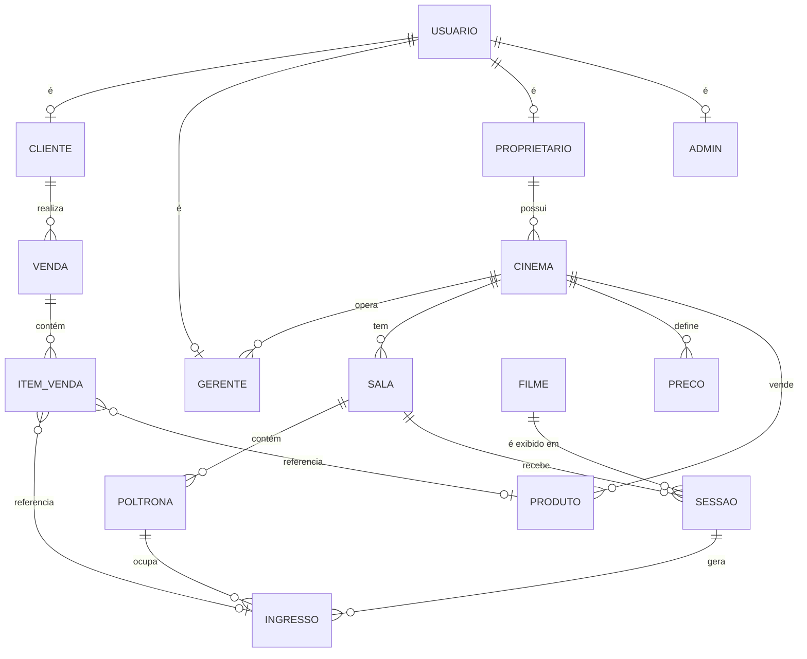

# 🎬 Poltrona — API de Venda de Ingressos e Gestão de Cinemas


API REST em **Java 21 + Spring Boot 3** para gestão de redes de cinema: hierarquia de proprietários, gerentes, cinemas e salas, layout dinâmico de poltronas, programação de sessões em lote, tabela de preços, venda de ingressos e produtos da bomboniere, com emissão de ingresso e comprovante em PDF com QR Code.

O foco do projeto é a **consistência de dados sob concorrência**: dois clientes nunca conseguem comprar a mesma poltrona na mesma sessão, uma venda é sempre atômica (tudo ou nada) e o estoque nunca fica negativo.

## 🚀 Deploy

| | |
|---|---|
| **Base URL** | https://poltrona.onrender.com/ |
| **Swagger UI** | https://poltrona.onrender.com/swagger-ui.html |

**Infraestrutura de produção:**

- **Render** — hospeda a API (Spring Boot) e o Redis usado como cache
- **Aiven** — hospeda o banco de dados MySQL como serviço gerenciado

> Hospedado em plano gratuito: a primeira requisição após um período ocioso pode levar alguns segundos (*cold start*).

---

## 📹 Apresentação do Projeto (RESUMIDA AO FLUXO PRINCIPAL)

[](https://www.youtube.com/watch?v=AZDOz4xqvSI)

> 💡 *Clique no botão acima para assistir à demonstração em vídeo do projeto.*


## 📑 Sumário

- [Destaques técnicos](#-destaques-técnicos)
- [Funcionalidades](#-funcionalidades)
- [Arquitetura](#-arquitetura)
- [Concorrência e transações](#-concorrência-e-transações)
- [Modelo de dados](#-modelo-de-dados)
- [Segurança](#-segurança)
- [Cache com Redis](#-cache-com-redis)
- [Tecnologias](#-tecnologias)
- [Como executar](#-como-executar)
- [Testes](#-testes)
- [Roadmap](#-roadmap)

## ✨ Destaques técnicos

| Problema | Solução adotada |
|---|---|
| Dois clientes comprando a mesma poltrona ao mesmo tempo | **Índice único funcional no MySQL** que vale apenas para ingressos `ATIVO` — a garantia final está no banco, não só na aplicação |
| Duas sessões sobrepostas na mesma sala (check-then-act) | **Lock pessimista** (`SELECT … FOR UPDATE`) na linha da sala durante o cadastro/atualização de sessões |
| Estoque da bomboniere ficando negativo | **`UPDATE` condicional atômico** (`… WHERE quantidade_estoque >= :qtd`) verificando as linhas afetadas |
| Venda parcial (ingresso salvo, produto sem estoque) | **Transação única** em `VendaService.cadastrar`: qualquer falha dá *rollback* de tudo |
| Atualizações concorrentes de sessão e produto | **Lock otimista** com `@Version` |
| Cadastro de programação extensa | **Grade de sessões em lote** com validação de conflitos em memória + banco e `saveAll` |
| Leituras repetidas de catálogo | **Cache Redis** com TTL de 10 min e invalidação nas escritas |
| Layout de sala flexível | **Mapa de poltronas dinâmico** (fileira → quantidade) com reativação/inativação segura |

## 🧩 Funcionalidades

- Autenticação stateless com **JWT** e autorização por papéis: `CLIENTE`, `GERENTE`, `PROPRIETARIO`, `ADMIN`
- Gestão hierárquica: proprietário → cinemas → salas → poltronas; gerentes vinculados a um cinema
- Layout de poltronas por sala (fileiras e quantidades configuráveis) com tipos: `COMUM`, `PREFERENCIAL`, `NAMORADEIRA`, `D_BOX`, `VIP`
- Catálogo de filmes com **cadastro em lote** (`POST /filmes/lote`)
- Sessões individuais ou em **grade** (`POST /sessoes/grade`): intervalo de datas × lista de horários
- Política operacional por cinema: intervalo de limpeza entre sessões, tolerância de compra após o início e antecedência mínima para cancelamento
- Preço por formato de exibição e ingresso `INTEIRA` / `MEIA`
- **Mapa de poltronas da sessão** com assentos livres/ocupados
- Venda combinada de ingressos + produtos, cancelamento de venda e de ingresso
- **PDF do ingresso e do comprovante de venda** com QR Code (OpenPDF + ZXing)
- Migrações versionadas com Flyway e documentação interativa com Swagger/OpenAPI
- Validações customizadas (CPF/CNPJ, CEP, telefone, UF, senha, datas, fileiras etc.) com Bean Validation

## 🏗️ Arquitetura

Arquitetura em camadas com separação clara de responsabilidades:

```
Controller  →  Service  →  Repository  →  MySQL
   (HTTP)     (regras,       (Spring Data    (constraints,
              transações)     JPA)            índices)
                  │
                  └──→ Redis (cache)
```

```
src/main/java/poltrona
├── controller/   # endpoints REST + anotações OpenAPI
├── service/      # regras de negócio, @Transactional, cache
├── repository/   # Spring Data JPA, queries JPQL, locks
├── entity/       # modelo de domínio (regras também vivem nas entidades)
├── dto/          # records imutáveis de entrada/saída
├── mapper/       # conversão entidade ↔ DTO
├── validation/   # anotações de validação customizadas
├── security/     # JwtService + JwtAuthFilter
├── config/       # Security, Redis, Swagger
├── exception/    # exceções de domínio + GlobalExceptionHandler
└── enums/
```

**Decisões de design**

- **Domínio rico**: regras como `Sessao.validarPermiteVenda()`, `Ingresso.cancelar()` e `PoliticaOperacional.isCancelamentoPermitido()` ficam nas entidades, e não espalhadas nos serviços.
- **DTOs como `record`**: payloads imutáveis; as entidades nunca são expostas na API.
- **Exceções de domínio** (`RegraNegocioException`, `ResourceNotFoundException`, `ResourceAlreadyExistsException`) traduzidas para HTTP em um único `@RestControllerAdvice`.
- **Schema controlado só por Flyway**: `ddl-auto=validate` — o Hibernate apenas confere se o mapeamento bate com o banco.

## 🔒 Concorrência e transações

Esta é a parte central do projeto. Cada mecanismo abaixo resolve um tipo diferente de condição de corrida.

### 1. Poltrona duplicada no checkout (race condition)

**O problema.** O fluxo de compra faz *check-then-act*: verifica se a poltrona está livre (`existsBySessaoIdAndPoltronaIdAndStatus`) e depois insere o ingresso. Entre as duas operações, outra requisição pode inserir o mesmo assento — ambas passam na verificação.

```
Cliente A: existe ingresso ATIVO? → não ┐
Cliente B: existe ingresso ATIVO? → não ┤  ← janela de corrida
Cliente A: INSERT ingresso ✅           │
Cliente B: INSERT ingresso ❌ (barrado pelo banco)
```

**A solução.** A verificação na aplicação serve só para dar uma mensagem amigável rapidamente (*fail-fast*). A **garantia real** é um índice único funcional criado na migração `V2`:

```sql
CREATE UNIQUE INDEX uk_sessao_poltrona_ativa
ON ingressos (
    (CASE WHEN status = 'ATIVO' THEN sessao_id   ELSE NULL END),
    (CASE WHEN status = 'ATIVO' THEN poltrona_id ELSE NULL END)
);
```

- É o equivalente a um **índice único parcial** (que o MySQL não possui): só ingressos `ATIVO` participam da unicidade, pois `NULL` não conflita com `NULL` em índices únicos.
- Um ingresso **cancelado** deixa de ocupar o assento, que volta a ficar disponível e pode ser vendido de novo — preservando o histórico.
- Quando duas transações tentam inserir o mesmo par, o InnoDB faz a segunda **esperar o commit da primeira** e então rejeita por chave duplicada. A transação perdedora sofre *rollback* completo.
- Funciona com várias instâncias da API, porque a garantia não depende de memória/JVM.

> Requer MySQL ≥ 8.0.13 (índices funcionais).

### 2. Conflito de horário de sessões na mesma sala

**O problema.** Impedir sobreposição de horários (somando o intervalo de limpeza) também é *check-then-act*, e o MySQL não consegue expressar "intervalos que não se sobrepõem" em uma constraint.

**A solução.** `buscarSalaEValidarAcesso` carrega a sala com `@Lock(PESSIMISTIC_WRITE)` (`SELECT … FOR UPDATE`). Dois gerentes cadastrando sessões na mesma sala são **serializados**: o segundo só executa `existeConflitoDeHorario` depois que o primeiro fez commit e, portanto, enxerga a sessão dele. Salas diferentes não se bloqueiam entre si.

### 3. Estoque da bomboniere sem *lost update*

Em vez de ler o estoque, subtrair em Java e salvar (padrão que perde atualizações), a baixa é um único `UPDATE` atômico:

```java
@Modifying
@Query("""
    UPDATE Produto p
    SET p.quantidadeEstoque = p.quantidadeEstoque - :quantidade
    WHERE p.id = :id AND p.quantidadeEstoque >= :quantidade
""")
int reduzirEstoque(Long id, Integer quantidade);
```

Se `0` linhas forem afetadas, o estoque era insuficiente e uma `RegraNegocioException` aborta a venda inteira. O InnoDB mantém o *row lock* até o commit, então duas vendas simultâneas do último item nunca resultam em estoque negativo.

### 4. Atomicidade da venda

`VendaService.cadastrar` é **uma única transação**. Ingressos (via `IngressoService.cadastrar`, que participa da mesma transação), baixa de estoque, `Venda` e `ItemVenda` (cascade) são persistidos juntos. Se qualquer poltrona estiver ocupada, a sessão encerrada ou o estoque insuficiente, **nada é gravado** — nem ingresso, nem baixa de estoque. O *rollback* acontece automaticamente porque `RegraNegocioException` é uma `RuntimeException`.

O cancelamento de venda também é transacional: marca a venda como `CANCELADA` e cancela todos os ingressos (via *dirty checking*), liberando as poltronas pelo mesmo índice condicional.

### 5. Lock otimista (`@Version`)

`Sessao` e `Produto` possuem coluna `version`. Se duas requisições editarem a mesma sessão simultaneamente, a segunda a gravar detecta a versão desatualizada e falha, em vez de sobrescrever silenciosamente a alteração da primeira.

### 6. Outras decisões transacionais

- `@Transactional(readOnly = true)` em todas as leituras (evita *flush* desnecessário e permite otimizações do driver/Hibernate).
- Cadastro de **grade de sessões** em uma só transação: se qualquer horário conflitar (com o banco ou com outro horário da própria grade), nenhuma sessão é criada.
- Alterar/desativar poltrona ou sala é bloqueado quando há ingressos `ATIVO` em sessões futuras, mantendo a integridade entre layout e vendas.

## 🗄️ Modelo de dados



- **Herança de usuários** por tabelas separadas (`usuarios` + `clientes`/`gerentes`/`proprietarios`/`admins`, mesma PK).
- `itens_venda` referencia ingresso **ou** produto (`tipo_item`), mantendo uma venda mista em um único agregado.
- O preço do ingresso é calculado na criação (`INTEIRA` ×1,00 / `MEIA` ×0,50 sobre o preço da sessão) e **congelado** no registro, então alterar a tabela de preços depois não afeta vendas passadas.

## 🔐 Segurança

- **JWT stateless** (`jjwt`), validado por um filtro (`JwtAuthFilter`) antes da cadeia do Spring Security.
- Autorização por papel em `SecurityConfig` e **verificação de propriedade nos serviços**: proprietário só mexe nos próprios cinemas, gerente só no cinema que opera, cliente só baixa/cancela os próprios ingressos.
- Handlers customizados para `401` (`AuthenticationEntryPoint`) e `403` (`AccessDeniedHandler`) com resposta JSON padronizada.
- Segredos (`JWT_SECRET`, credenciais do banco) lidos de **variáveis de ambiente**.

## ⚡ Cache com Redis

- `@EnableCaching` com Redis como provedor, TTL de **10 minutos**, valores em JSON e sem cache de `null`.
- Cacheados: listagem/consulta de **sessões** e **produtos**; invalidados (`@CacheEvict`) nas operações de escrita.
- O **mapa de poltronas** não é cacheado de propósito: muda a cada venda e precisa refletir o estado real.

## 🛠️ Tecnologias

| Camada | Tecnologia |
|---|---|
| Linguagem / framework | Java 21, Spring Boot 3.4 |
| Persistência | Spring Data JPA + Hibernate, MySQL 8, Flyway |
| Cache | Spring Data Redis |
| Segurança | Spring Security, JWT (jjwt 0.12) |
| Validação | Jakarta Bean Validation + validadores customizados |
| Documentos | OpenPDF (PDF), ZXing (QR Code) |
| Documentação | springdoc-openapi / Swagger UI |
| Build / infra | Maven, Docker, Docker Compose |
| Testes | JUnit 5, Mockito, Spring Boot Test |
| Hospedagem | **Render** (API e Redis), **Aiven** (MySQL gerenciado) |
| Ferramentas de desenvolvimento | **VS Code** (IDE), **Insomnia** (testes manuais da API), **DBeaver** (cliente de banco de dados) |

### Ferramentas utilizadas no desenvolvimento

- **VS Code** — ambiente de desenvolvimento do código Java/Spring Boot.
- **Insomnia** — requisições HTTP para testar os endpoints, os fluxos de autenticação com JWT e os cenários de venda durante o desenvolvimento.
- **DBeaver** — inspeção do schema MySQL, conferência das migrações do Flyway e análise dos índices e dados gerados pelas vendas.

## ▶️ Como executar

### Variáveis de ambiente

| Variável | Descrição |
|---|---|
| `DB_URL` | URL JDBC do MySQL (ex.: `jdbc:mysql://localhost:3306/poltrona_db`) |
| `DB_USERNAME` / `DB_PASSWORD` | Credenciais do banco |
| `JWT_SECRET` | Chave de assinatura do JWT (gere com `openssl rand -hex 32`) |
| `JWT_EXPIRATION` | Validade do token, em milissegundos |
| `REDIS_HOST` / `REDIS_PORT` | Host e porta do Redis (porta padrão `6379`) |

### Opção 1 — Docker Compose (recomendado)

Sobe API, MySQL e Redis já conectados.

```bash
git clone https://github.com/AmadeusBertoline/poltrona.git
cd poltrona

# crie um .env com DB_USERNAME, DB_PASSWORD, JWT_SECRET e JWT_EXPIRATION
docker compose up --build
```

API em `http://localhost:8080` · Swagger em `http://localhost:8080/swagger-ui.html`.

### Opção 2 — Ambiente local

Pré-requisitos: **Java 21+**, MySQL 8.0.13+ e Redis.

```bash
git clone https://github.com/AmadeusBertoline/poltrona.git
cd poltrona

export DB_URL="jdbc:mysql://localhost:3306/poltrona_db"
export DB_USERNAME=root
export DB_PASSWORD=sua_senha
export JWT_SECRET=$(openssl rand -hex 32)
export JWT_EXPIRATION=3600000

./mvnw spring-boot:run
```

O Flyway cria o schema automaticamente na primeira execução.

## ✅ Testes

```bash
./mvnw test
```

Suíte de **testes unitários** (JUnit 5 + Mockito) cobrindo as 15 classes de serviço, 228 testes — regras de negócio, validações de acesso por papel, cenários de erro e fluxos de venda/cancelamento.

## 🗺️ Roadmap

- [ ] Mapear violação do índice único (`DataIntegrityViolationException`) para **HTTP 409 Conflict** com mensagem amigável quando duas compras disputam a mesma poltrona
- [ ] Testes de integração de concorrência com **Testcontainers** (MySQL real), disparando N compras simultâneas da mesma poltrona
- [ ] Reserva temporária de assento com expiração (hold) usando Redis
- [ ] Devolução de estoque no cancelamento de venda
- [ ] Respostas de erro no padrão RFC 7807 (`ProblemDetail`)

## 👤 Autor

**Amadeus Bertoline** — Software Engineer

[GitHub](https://github.com/AmadeusBertoline)
